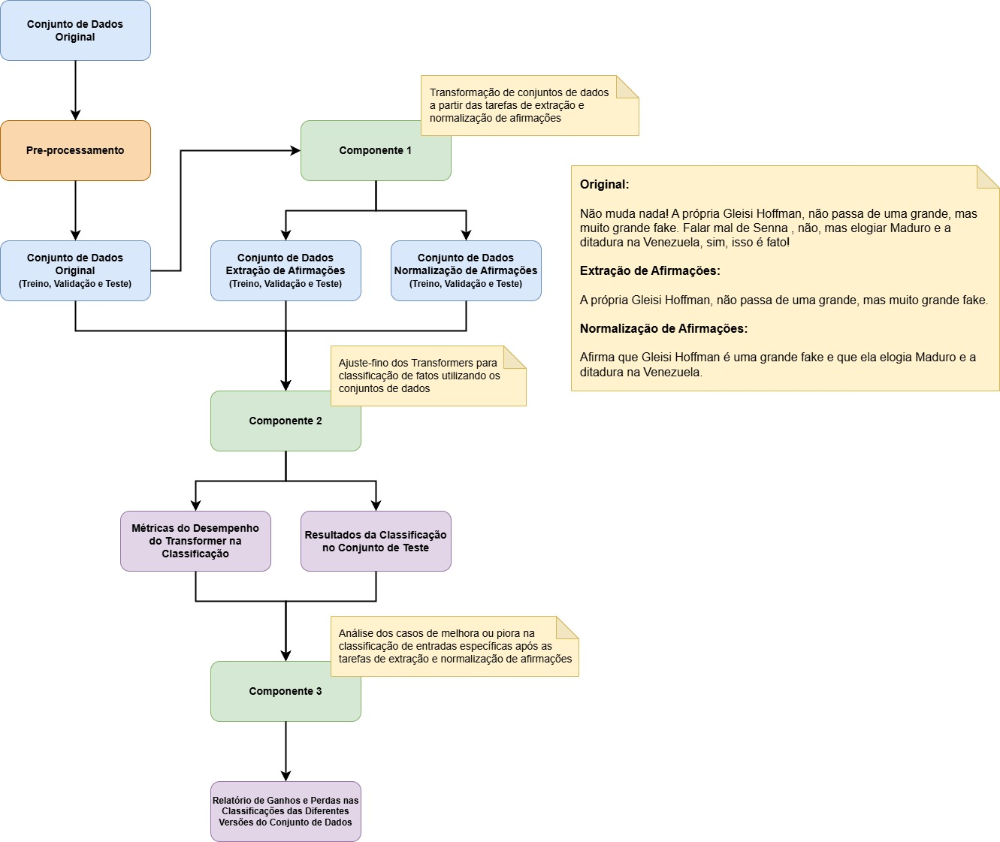

# TCC: Claim Extraction, Normalization, and Fact-Checking

This repository contains the implementation of my Bachelor's Degree Thesis, which focuses on the development of a pipeline for claim extraction, normalization, and fact-checking in the context of misinformation detection. The project leverages state-of-the-art natural language processing (NLP) techniques and transformer-based models to address the challenges of identifying, normalizing, and verifying claims in Portuguese-language datasets.

## Project Overview

The goal of this thesis is to create a robust and scalable system that can:

1. **Extract Claims**: Identify and extract claims from text data.
2. **Normalize Claims**: Standardize the extracted claims to a consistent format for further processing.
3. **Fact-Check Claims**: Verify the truthfulness of the normalized claims using fine-tuned transformer models.

The pipeline is designed to work with datasets in Portuguese, focusing on combating misinformation in Brazilian contexts, such as fake news and misleading social media posts.

## Project Architecture



## Repository Structure

The repository is organized as follows:

```
.
├── README.md                # Project documentation
├── requirements.txt         # Python dependencies
├── articles/                # Research articles and references
│   ├── claim_extraction_and_normalization/
│   ├── databases_references/
│   ├── fact_checking/
│   └── methodology/
├── assets/                  # Visual assets and LaTeX files
│   ├── experiment_architecture.drawio
│   ├── training_combinations.drawio
│   └── LaTeX/
├── data/                    # Datasets and results
│   ├── fakebr/              # FakeBR dataset and related files
│   └── faketweetbr/         # FakeTweetBR dataset and related files
├── notebooks/               # Jupyter notebooks for experiments
│   ├── 01-generate-datasets.ipynb
│   ├── 02-fine-tune-transformer.ipynb
│   ├── 03-compare-classifications.ipynb
│   └── shared/
├── utils/                   # Utility scripts
│   ├── calculate_dabatases_metrics.py
│   ├── generate_fine_tuning_output_table.py
│   └── split_train_test_sources.py
```

### Key Components

#### 1. Claim Extraction and Normalization

The first step in the pipeline involves extracting claims from text data and normalizing them into a structured format. This is achieved using advanced NLP techniques and pre-trained transformer models. The extracted claims are stored in structured datasets for further processing.

#### 2. Fine-Tuning Transformer Models for Fact-Checking

The second step involves fine-tuning transformer models, such as `neuralmind/bert-large-portuguese-cased` and `xlm-roberta-large`, to classify claims as either "true" or "fake." The fine-tuning process is conducted using the datasets generated in the previous step. The results, including metrics and predictions, are saved for further analysis.

#### 3. Comparative Analysis of Model Classifications

The final step is a comparative analysis of the classifications made by different models. This involves combining the classification results, analyzing their performance, and generating a detailed report to evaluate the effectiveness of each model.

## Notebooks

The project includes three main Jupyter notebooks:

1. **[01-generate-datasets.ipynb](notebooks/01-generate-datasets.ipynb)**: Responsible for generating datasets for claim extraction and normalization tasks.
2. **[02-fine-tune-transformer.ipynb](notebooks/02-fine-tune-transformer.ipynb)**: Fine-tunes transformer models for the fact-checking task.
3. **[03-compare-classifications.ipynb](notebooks/03-compare-classifications.ipynb)**: Compares the classification results of different models and generates a detailed report.

## Datasets

The project uses two main datasets:

1. **FakeBR**: A dataset containing claims and their classifications in Portuguese.
2. **FakeTweetBR**: A dataset focused on claims extracted from Brazilian tweets.

Each dataset is organized into the following subdirectories:

- `batches/`: Contains intermediate files generated during dataset processing.
- `claim_extraction/`: Stores extracted claims.
- `claim_normalization/`: Stores normalized claims.
- `classification_results/`: Contains classification results from fine-tuned models.
- `fine-tuning/`: Includes fine-tuned models and related files.
- `original/`: Contains the original datasets (train, validation, and test splits).

## Results

The results of the fact-checking task are stored in the `classification_results/` directory. This includes:

- **Combined Classification Results**: A CSV file that aggregates the predictions from different models.
- **Comparison Report**: A JSON file that provides a detailed analysis of the performance of each model.

## Article

The project is supported by a comprehensive article that details the methodology, experiments, and results. The article is named `Investigating the Impact of the Claim Extraction and Claim Normalization Tasks on the Classification of Facts in Portuguese with Transformers` and can be found in the root of the `articles/` directory, organized into sections corresponding to different aspects of the research.

## How to Run the Project

1. **Install Dependencies**:

   ```bash
   pip install -r requirements.txt
   ```

2. **Generate Datasets**:
   Run the first notebook to generate the datasets for claim extraction and normalization.

3. **Fine-Tune Transformer Models**:
   Use the second notebook to fine-tune the transformer models for the fact-checking task.

4. **Compare Classifications**:
   Execute the third notebook to compare the classification results and generate a report.

## Technologies Used

- **Python**: Programming language used for the implementation.
- **Transformers**: Hugging Face library for pre-trained transformer models.
- **PyTorch**: Deep learning framework for model training.
- **Pandas**: Data manipulation and analysis.
- **Datasets**: Library for dataset loading and processing.
- **Evaluate**: Library for computing evaluation metrics.

## Contact

For any questions or inquiries, feel free to reach out:

- **Name**: Lucca Sabbatini
- **Email**: [sabbatini.lucca@gmail.com](mailto:sabbatini.lucca@gmail.com)
- **LinkedIn**: [https://www.linkedin.com/in/luccasabbatini/](https://www.linkedin.com/in/luccasabbatini/)

---

This project represents the culmination of my Bachelor's Degree Thesis and showcases my skills in natural language processing, machine learning, and data analysis. Thank you for visiting my repository!
